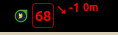
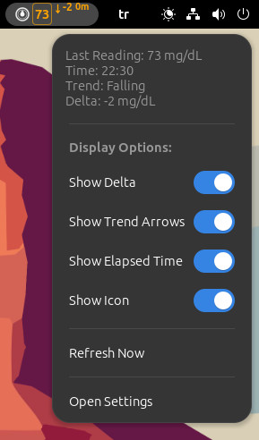
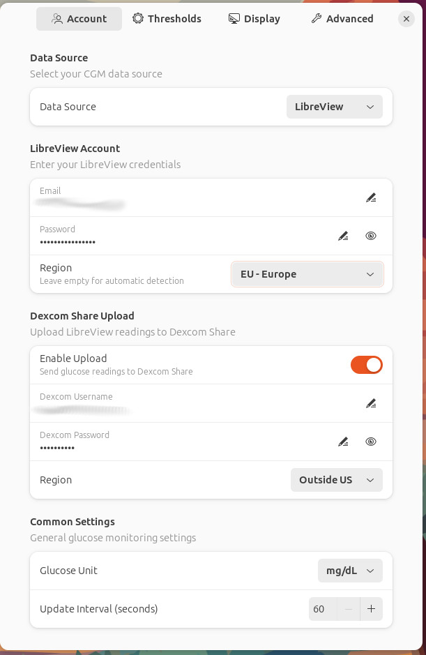
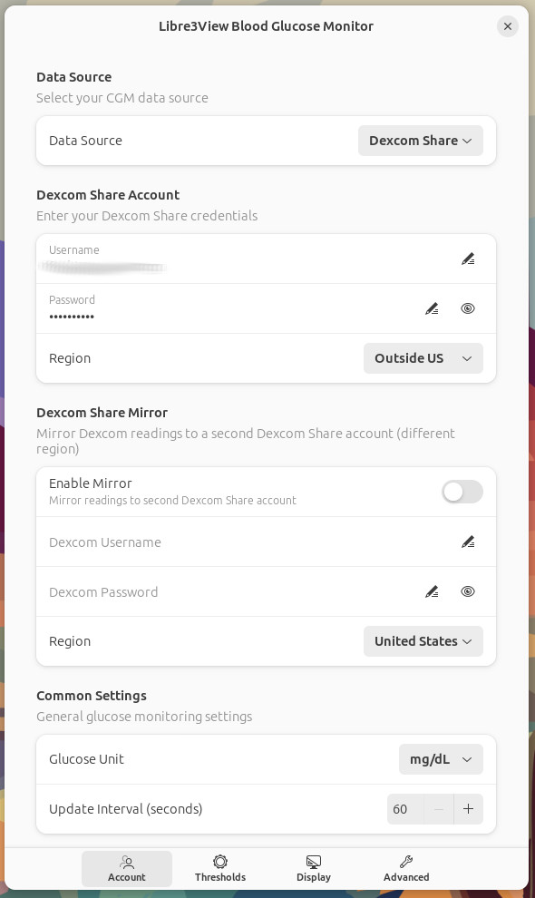
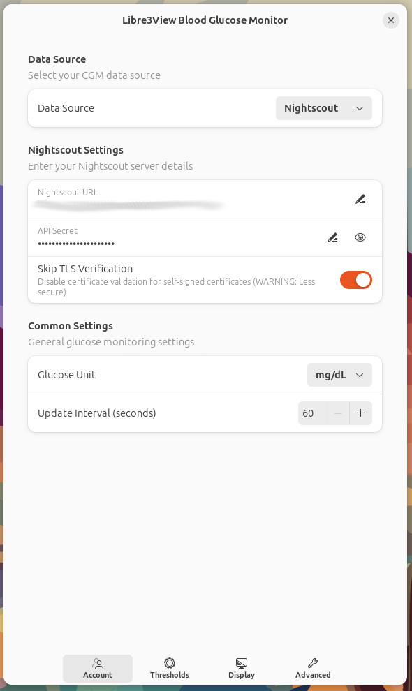
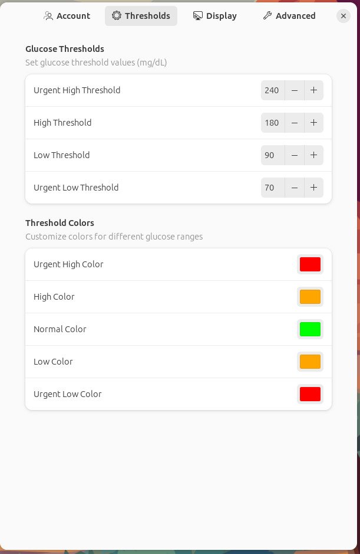

# Libre3View - Blood Glucose Monitor GNOME Extension


A GNOME Shell extension that displays real-time blood glucose levels from **FreeStyle Libre** (via LibreView/LibreLinkUp) in your GNOME top panel. Optionally supports **Dexcom Share** and **Nightscout** as additional data sources.

**Important Notice:** This extension is not affiliated with Abbott, Dexcom, or any CGM manufacturer.
## Screenshots













## Features

- **Multiple Data Sources**:
  - **LibreView/LibreLinkUp** (Primary) - FreeStyle Libre 1, 2, 3 sensors
  - **Dexcom Share** - Dexcom G6, G7 sensors
  - **Nightscout** - Self-hosted CGM data aggregator
- **Real-time Monitoring**: Display current glucose levels directly in your GNOME top panel
- **Visual Indicators**:
  - Dynamic trend arrows showing glucose direction
  - Delta values indicating glucose changes
  - Elapsed time since last reading
  - Color-coded display based on glucose ranges
- **Optional Dexcom Share Upload**: Bridge LibreView data to Dexcom Share for use with Dexcom-compatible apps
- **Customizable Display**:
  - Support for both mg/dL and mmol/L units
  - Configurable update intervals
  - Toggle delta values, trend arrows, and time display
  - Adjustable icon position

## Prerequisites for LibreView/LibreLinkUp

**IMPORTANT:** The LibreView API uses the **LibreLinkUp** follower system. You must set up sharing before using this extension.

### Step 1: Enable LibreLinkUp Sharing (Required)

1. **On your phone with FreeStyle Libre app:**
   - Open the **FreeStyle Libre 3** (or Libre 2) app
   - Go to **Menu** > **Share** or **Connected Apps**
   - Enable **LibreLinkUp**
   - Tap **Share** and enter the email of your follower account

2. **Create or use a follower account:**
   - You can use a different email address to create a follower account
   - Or invite someone else as a follower
   - The follower will receive an invitation email

3. **Accept the invitation:**
   - Open the LibreLinkUp app or website
   - Log in with the follower account
   - Accept the connection invitation

### Step 2: Use Follower Credentials in Extension

**Use the FOLLOWER account credentials** (not your patient account) in the extension settings.

```
Patient Account (LibreLink app)  -->  LibreView Cloud  -->  Follower Account (LibreLinkUp)
        |                                    |                        |
   Scans sensor                        Stores data              Use these credentials
                                                                 in extension!
```

## Installation

### From GNOME Extensions Website
1. Visit [GNOME Extensions](https://extensions.gnome.org)
2. Search for "Libre3View Blood Glucose Monitor"
3. Click "Install"

### Manual Installation
1. Clone this repository:
   ```bash
   git clone https://github.com/faymaz/libre3view
   ```
2. Copy to GNOME extensions directory:
   ```bash
   cp -r libre3view ~/.local/share/gnome-shell/extensions/libre3view@faymaz.github.com
   ```
3. Compile the settings schema:
   ```bash
   cd ~/.local/share/gnome-shell/extensions/libre3view@faymaz.github.com
   glib-compile-schemas schemas/
   ```
4. Restart GNOME Shell:
   - For X11 sessions: Press Alt+F2, type 'r', press Enter
   - For Wayland sessions: Log out and log back in
5. Enable the extension:
   ```bash
   gnome-extensions enable libre3view@faymaz.github.com
   ```

## Configuration

### LibreView Settings (Primary Data Source)

| Setting | Description |
|---------|-------------|
| Email | Your **LibreLinkUp follower** account email |
| Password | Your LibreLinkUp follower account password |
| Patient ID | (Optional) Select specific patient if following multiple |

### Dexcom Share Settings (Alternative Data Source)

| Setting | Description |
|---------|-------------|
| Username | Dexcom Share account username |
| Password | Dexcom Share account password |
| Region | US or Non-US (determines API endpoint) |

### Dexcom Share Upload (Optional)

Enable this to upload LibreView glucose data to Dexcom Share, allowing use with Dexcom-compatible apps and services.

| Setting | Description |
|---------|-------------|
| Enable Upload | Toggle uploading to Dexcom Share |
| Username | Dexcom Share account for upload |
| Password | Dexcom Share password |
| Region | US or Non-US |

### Display Settings

| Setting | Description |
|---------|-------------|
| Unit | mg/dL or mmol/L |
| Update Interval | How often to fetch new data (60-600 seconds) |
| Show Icon | Display glucose icon in panel |
| Show Trend Arrows | Display glucose direction arrows |
| Show Delta | Display glucose change since last reading |
| Show Elapsed Time | Display time since last reading |
| Icon Position | Left or right side of panel |

### Threshold Settings

Customize glucose ranges and colors:

| Threshold | Default (mg/dL) | Description |
|-----------|-----------------|-------------|
| Urgent High | 240 | Critical high alert |
| High | 180 | Above target range |
| Low | 70 | Below target range |
| Urgent Low | 55 | Critical low alert |

## Troubleshooting

### Check Logs
```bash
journalctl -f -o cat /usr/bin/gnome-shell | grep -i "Libre\|Dexcom"
```

### Common Issues

#### "NO_DATA: No patient connections found"

**Cause:** LibreLinkUp sharing is not configured, or you're using the wrong account type.

**Solution:**
1. Make sure LibreLinkUp is enabled in your FreeStyle Libre app
2. Verify you've invited and accepted a follower
3. Use the **FOLLOWER** account credentials in the extension (not your patient account)

#### "AUTH_ERROR: Invalid credentials"

**Cause:** Wrong email or password.

**Solution:**
1. Verify your LibreLinkUp follower credentials
2. Try logging into the LibreLinkUp app/website to confirm they work
3. Check if your account is locked due to too many failed attempts

#### "NETWORK_ERROR: Connection failed"

**Cause:** Network connectivity issues or LibreView servers unreachable.

**Solution:**
1. Check your internet connection
2. Try again later (servers might be temporarily unavailable)
3. Check if a VPN is blocking the connection


## Privacy & Security

- Credentials are stored locally using GNOME's GSettings
- All API communication uses HTTPS encryption
- No data is sent to third parties (except Dexcom Share if upload is enabled)
- Open source code available for security review

## Compatibility

- GNOME Shell 45, 46, 47, 48, 49
- FreeStyle Libre 1, 2, 3 (via LibreLinkUp)
- Dexcom G6, G7 (via Dexcom Share)
- Nightscout (self-hosted)
- Internet connection required

## License

This project is licensed under the GNU General Public License v3.0.

## Disclaimer

This software is not affiliated with Abbott, Dexcom, or any CGM manufacturer. The extension is provided "as is" without warranty of any kind. **Do not make medical decisions based on this extension.** Always verify glucose values using your official CGM receiver or app.

## Support & Contributions

- Report issues: [GitHub Issues](https://github.com/faymaz/libre3view/issues)
- Feature requests welcome
- Contributions welcome through pull requests

## Author

- [faymaz](https://github.com/faymaz)

## Acknowledgments

- LibreView API documentation from community reverse engineering efforts
- Dexcom Share API documentation from open source projects
- GNOME Shell Extension development community
